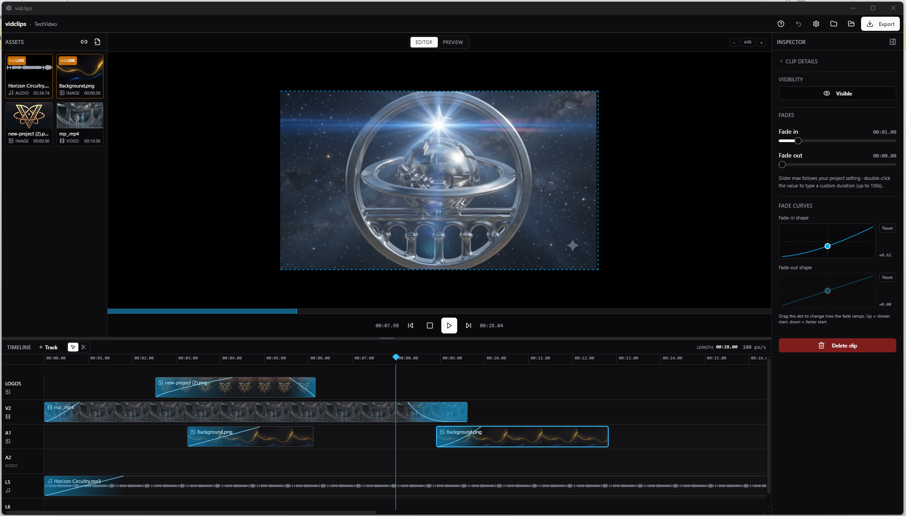

<div align="center">



# vidclips

**A simple, portable desktop video editor built for fast, focused edits.**

[](LICENSE)
[](#)
[](https://www.electronjs.org/)
[](https://react.dev/)
[](https://www.typescriptlang.org/)
[](https://tailwindcss.com/)
[](https://www.sqlite.org/)
[](https://ffmpeg.org/)

</div>

---

## Overview

vidclips is a minimalist local video editor inspired by ClipChamp. The entire project — clips, timeline, assets, settings — lives in a single folder on disk: a `project.db` SQLite file plus an `assets/` subfolder. Open the folder, get back to work; no cloud, no sign-in, no telemetry.

It runs as a portable Windows `.exe` (no installer) so you can drop it on a USB stick, point it at a project folder, and edit.

## Features

- **Drag-and-drop timeline** with multiple type-agnostic tracks — video, image, and audio clips can live on any layer.
- **Trim, move, split, and delete** clips on the timeline; overlap-aware so clips snap to non-overlapping slots.
- **Live preview** with the playhead following clips in real time, plus a scrubbable ruler.
- **Editor mode** turns the preview pane into a composition canvas — select layers and **drag to move, scale, or rotate** them. A dotted outline marks the exportable region; layers can be positioned outside it for finer placement. `Ctrl+wheel` zooms the canvas.
- **Fade in / fade out** with adjustable duration and a per-clip **curve editor** (drag the node to reshape the ramp). Applied identically to video, image, and audio chains in both preview and export.
- **Mute / hide toggles** per clip — hide the visual of a video to use only its audio, or mute the audio to keep the visual.
- **Linked assets**: choose whether to copy media into the project, or reference it in place (useful for very large files).
- **Project settings**: aspect ratio / resolution presets (16:9, 9:16, 1:1, 4:3, 21:9, custom), frame rate, project length, max fade duration.
- **Undo history** (up to 50 actions) backed by closures — covers drops, moves, trims, splits, deletes, transforms, project-length changes, and visibility toggles.
- **MP4 export** via bundled ffmpeg: scales, rotates, fades (with curves), audio mix, and respects layer order.
- **Built-in shortcuts dialog** lists every keyboard and mouse interaction by feature.

## Quick start

> Requires Node.js 20+ and npm. Tested on Windows 11.

```bash
git clone https://github.com/harmonichemispheres/vidclips.git
cd vidclips
npm install      # also rebuilds better-sqlite3 against the Electron ABI
npm run dev      # launches the app in development mode
```

That's it. The app opens to a start screen where you can pick a folder for a new project or open an existing one.

## Usage

### Creating a project

1. Click **New Project** on the start screen and pick a folder.
2. Drop media files into the left **Assets** pane — choose <kbd>📎 Link</kbd> to reference files in place or <kbd>+ Import</kbd> to copy them into the project. Linked assets get an amber border.

### Editing on the timeline

- **Drag** an asset from the library onto a track to create a clip.
- **Drag** clips left/right to move them; **drag the edges** to trim.
- Use the **Cut tool** (scissors icon in the timeline header) and click a clip to split it at the click position.
- Drag the red **END** marker to set the project length, or click the **Length** field to type a value.
- Drag the horizontal divider above the timeline to give yourself more vertical space.
- `Ctrl + mouse wheel` zooms the timeline.

### Editor mode

Toggle **Editor** at the top of the preview pane:
- Click a visual layer to select it.
- Drag the body to **move**, corners to **scale** (anchored at the opposite corner), or the handle above to **rotate**.
- A dotted outline marks the exportable region; you can drag layers outside it for fine placement.
- `Ctrl + mouse wheel` zooms the canvas.

### Inspecting a clip

The right-side Inspector shows clip details, Visibility (Hide/Mute), Fades, and Fade curves. Double-click any fade time to type a custom value (up to 100s). Drag the curve node up to slow the start of a fade, down to speed it up.

### Exporting

Click **Export** in the topbar, choose an MP4 path, and let ffmpeg render. The export respects every clip's transforms, fades, fade curves, mute/hide state, and layer order.

### Shortcuts

Click the **?** button in the topbar for a categorised reference of every keyboard and mouse shortcut.

## Project structure on disk

```
my-project/
├── project.db          # SQLite (all clips, tracks, project meta)
└── assets/
    ├── intro.mp4       # copied media (or just references for linked assets)
    ├── …
    └── .thumbs/        # generated thumbnails (160×90 JPG)
```

Reopen the folder any time — vidclips writes through to SQLite on every mutation, so there is no save button.

## Building a portable executable

```bash
npm run package
```

This runs `electron-vite build` and then `electron-builder --win portable`. The output appears in `dist/` as a single self-contained `.exe`. The bundled `ffmpeg.exe`, `ffprobe.exe`, and the `better_sqlite3.node` native module are unpacked from the asar archive so they can be located at runtime.

## Tech stack

| Layer | Choice |
| --- | --- |
| Shell | [Electron](https://www.electronjs.org/) 33 (Chromium + Node) |
| Bundler | [electron-vite](https://electron-vite.org/) with `@vitejs/plugin-react` |
| UI | [React](https://react.dev/) 18 + [shadcn/ui](https://ui.shadcn.com/) primitives + [Tailwind CSS](https://tailwindcss.com/) 3 |
| State | [Zustand](https://github.com/pmndrs/zustand) 5 with `useShallow` selectors |
| Drag & drop | [dnd-kit](https://dndkit.com/) |
| Persistence | [better-sqlite3](https://github.com/WiseLibs/better-sqlite3) in the main process, custom protocol (`vidclips://`) for renderer media access |
| Media | [ffmpeg-static](https://github.com/eugeneware/ffmpeg-static) + [ffprobe-static](https://github.com/joshwnj/node-ffprobe-installer) (bundled), HTML5 `<video>` / `<audio>` for preview |
| Packaging | [electron-builder](https://www.electron.build/) (portable Windows target) |

## License

MIT © Robby Boney. See [LICENSE](LICENSE) for details.
